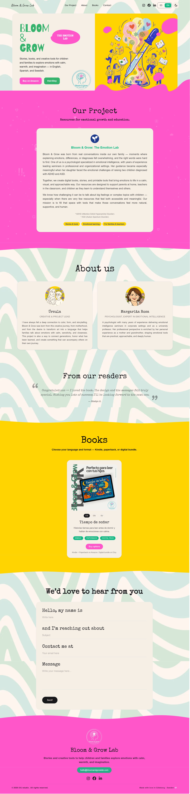
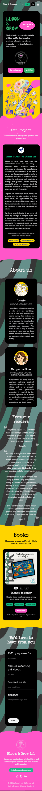

# Bloom & Grow Lab The Emotion Lab:

Created by **Ursula Vallejo**
Frontend Developer · Creative

Bloom & Grow Lab is a creative and educational web project focused on emotional learning for children and families.
The platform presents books, tools, and resources designed to help children explore emotions in a safe, playful, and accessible way.

Live site:

🔗 [www.bloomandgrowlab.com](https://www.bloomandgrowlab.com)

---

## Project Concept & Design

The visual layout and structure of the website are intentionally designed to reflect the core idea of the project:

- **Families & children first** — friendly, warm, and non-intimidating
- **Playful but structured** — clear hierarchy without feeling rigid
- **Emotion-driven design** — colors, shapes, and motion support emotional expression

### Visual language

- **Vibrant and soft color palette** to communicate joy, safety, and creativity
- **Rounded shapes and organic blobs** inspired by children’s illustration styles
- **Large typography and generous spacing** to improve readability
- **Subtle animations** used as emotional guidance, not decoration

Motion and interaction are intentionally minimal and respectful of accessibility preferences.

---

## Accessibility & Motion

Accessibility is a core part of this project:

- Respects `prefers-reduced-motion`
- Semantic HTML structure
- Proper ARIA attributes where needed
- Keyboard navigable UI
- Decorative elements marked as `aria-hidden`
- Focus styles carefully controlled to avoid visual noise

Animations automatically disable for users who prefer reduced motion.

---

## Tech Stack

**Frontend**

- Next.js (App Router)
- React
- TypeScript
- Tailwind CSS
- Framer Motion
- next-intl (i18n)

**Tooling**

- ESLint
- Prettier
- Vercel (hosting & deployment)

---

## 🚀 Getting Started

Clone the repository:

```bash
git clone https://github.com/your-username/bloom-and-grow-lab.git
cd bloom-and-grow-lab
```

Install dependencies:

```bash
npm install
```

Run the development server:

```bash
npm run dev
```

Open your browser at:

```
http://localhost:3000
```

---

## Internationalization

The site supports multiple languages using `next-intl`.
Content and layout adapt seamlessly between locales.

---

## Project Status

This project is actively evolving.
Future improvements may include:

- Additional educational content
- Printable resources for families
- Expanded accessibility testing
- Performance optimizations

---

## Screenshots

Bloom & Grow Lab – Full Page Desktop



Bloom & Grow Lab – Full Page Mobile



---
